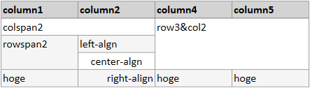
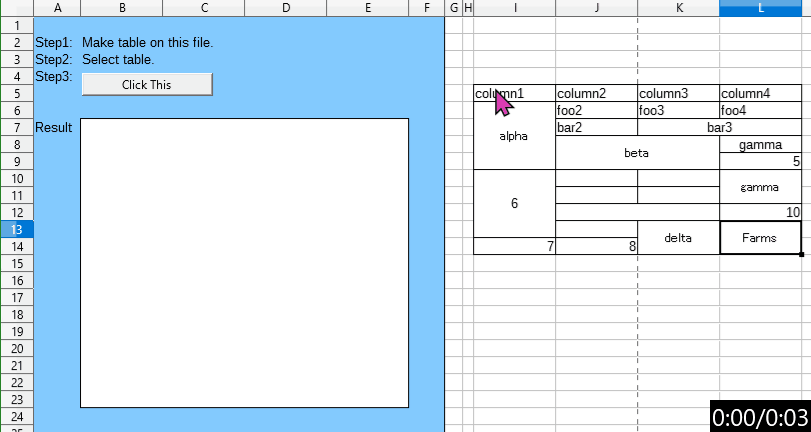

# Enhance of table

MdXaml extends table format to explain colspan and rowspan. Its format is Influenced by textile.

## Example

```txt
| column1     | column2       | column4       | column5  |
|-------------|---------------|---------------|----------|
|\2. colspan2                 |/3\2. row3&col2           |
|/2. rowspan2 |<. left-algn   |
              |=. center-algn |
| hoge        |>. right-align | hoge          | hoge     |

```


## Format

Type any character between pipe(|) and period(.), and MdXaml parse it.

| char | details                                                      |
|------|--------------------------------------------------------------|
| \\   | column span: after character parse as the number as columns. |
| /    | row span: after character parse as the number as rows.       |
| <    | left alignment  |
| >    | right alignment |
| =    | center          |

If you don't want to parse, type space after pipe(|).

```txt
| column1     | column2       |
|-------------|---------------|
|\2. parse as column span     |
| \2. ignore  | hoge          |
```


## MarkdownTableBuilder.ods

To make table easily, We provide 'MarkdownTableBuilder.ods'.
With LibreOffice It can open it and execute macros.

