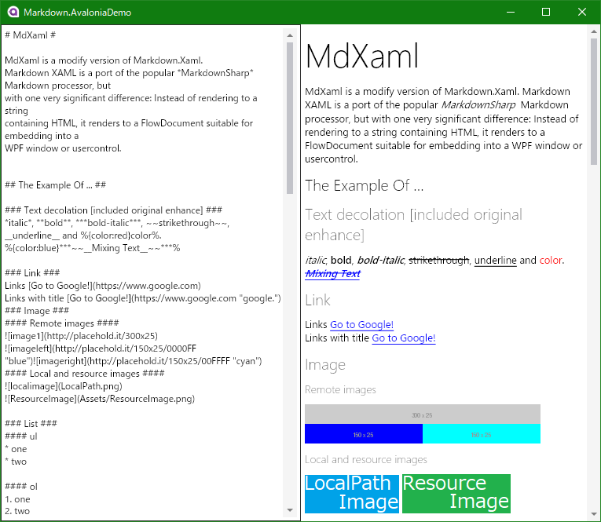
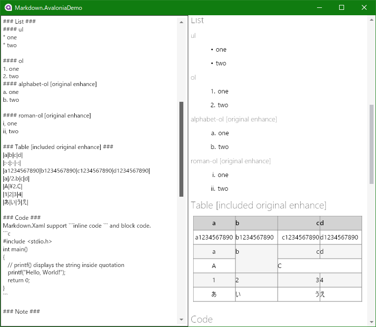
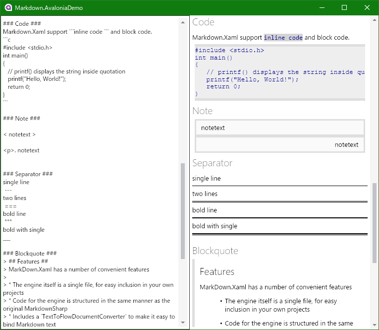
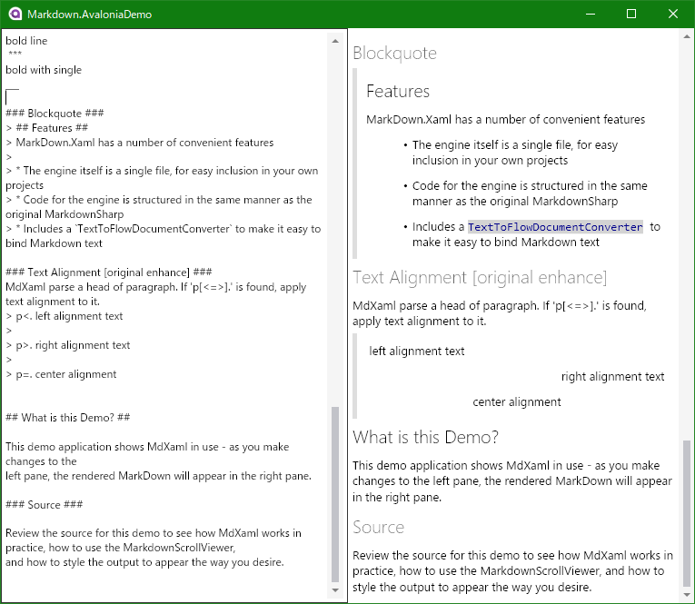

# Markdown.Avalonia

Markdown.Avalonia is a portted version of [MdXaml](https://github.com/whistyun/MdXaml) for [Avalonia UI](https://www.avaloniaui.net/).
It can render Markdown with avalonia.

## Sample

  
  
  
  

## Nuget

https://www.nuget.org/packages/Markdown.Avalonia/

## License

Markdown.Avalonia is licensed under the MIT license.
