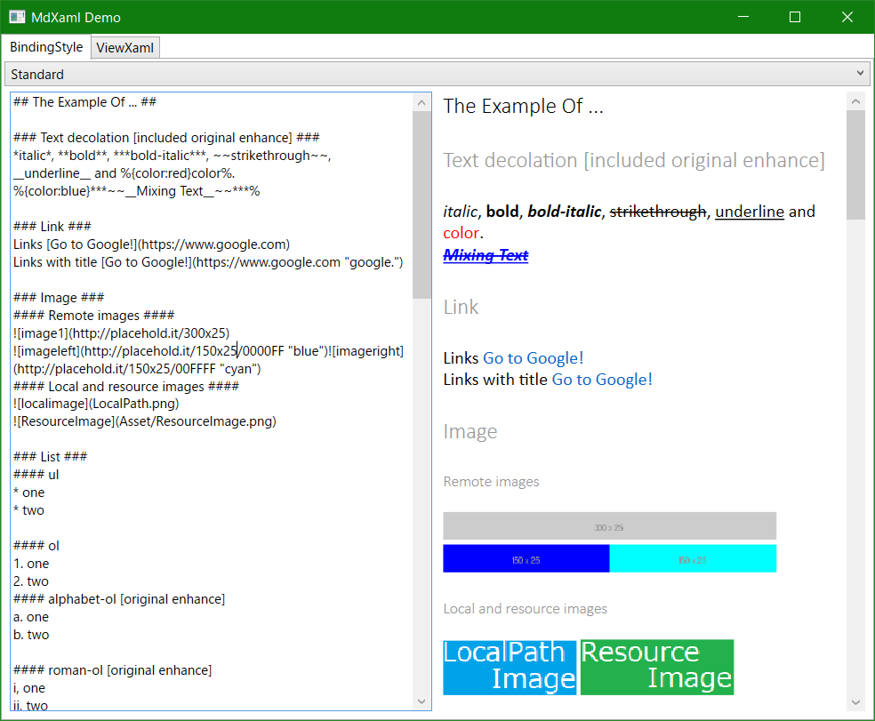
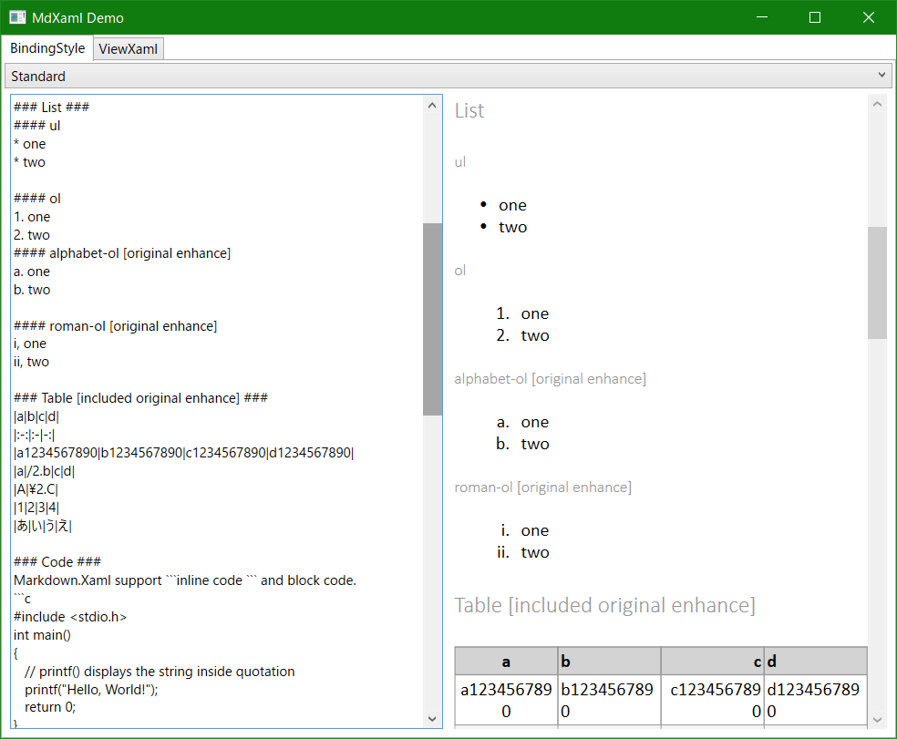
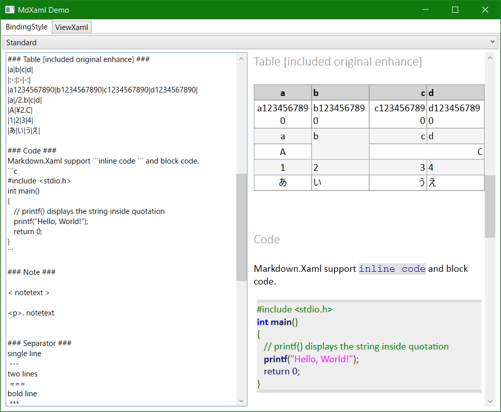
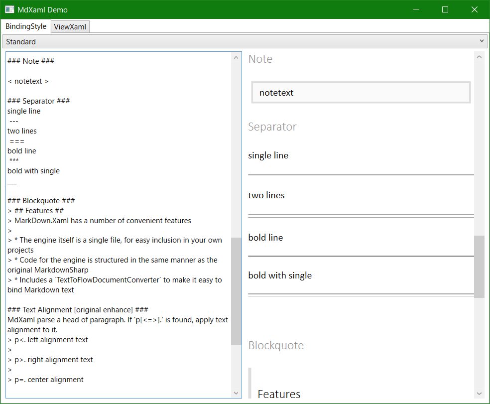
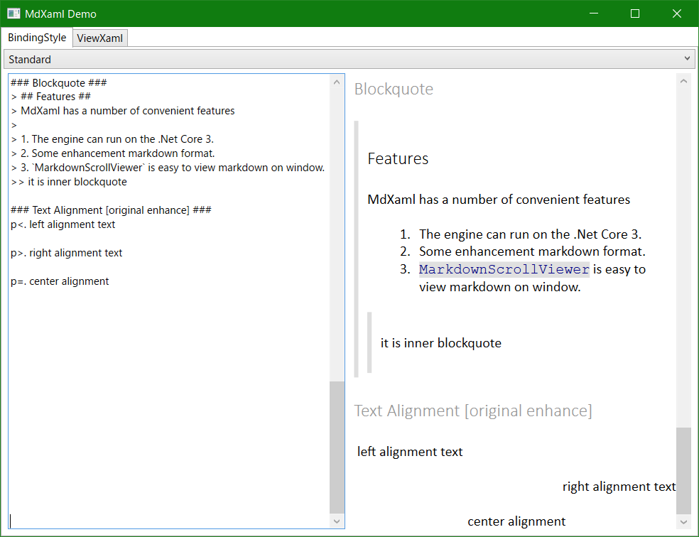

# MdXaml

MdXaml is a modify version of Markdown.Xaml.
It can convert Markdown to FlowDocument of WPF.


## What is Markdown XAML?

[see the origin project page](https://github.com/theunrepentantgeek/Markdown.XAML)

Markdown XAML is a port of the popular 
[MarkdownSharp](http://code.google.com/p/markdownsharp/) Markdown processor, but with one very 
significant difference: Instead of rendering to a string containing HTML, it renders to a 
[FlowDocument](http://msdn.microsoft.com/en-us/library/system.windows.documents.flowdocument.aspx) 
suitable for embedding into a WPF window or usercontrol.

With HTML output, details of fonts and colours (and so on) are handled by CSS, but with a 
FlowDocument there's no direct equivalent. Instead of the HTML approch of linking a 
stylesheet to the rendered output, MarkDown.Xaml uses WPF styles that are linked to
the rendering engine and applied to the output as it is generated. See the *included demo* 
application for an example of how this can be configured.

## Samle







## Nuget

[https://www.nuget.org/packages/MdXaml/](https://www.nuget.org/packages/MdXaml/)

## Quick start

### Convert markdown-string in a code.

```cs
// using MdXaml;
// using System.Windows.Documents;

Markdown engine = new Markdown();

string markdownTxt = System.IO.File.ReadAllText("example.md");

FlowDocument document = engine.Transform(markdownTxt);
```

### Write markdown in a xaml.

```xml
<Window x:Class="HeredocSample.MainWindow"
        xmlns="http://schemas.microsoft.com/winfx/2006/xaml/presentation"
        xmlns:x="http://schemas.microsoft.com/winfx/2006/xaml"
        xmlns:mdxam="clr-namespace:MdXaml;assembly=MdXaml"
        Title="MainWindow" Height="450" Width="800">

	<mdxam:MarkdownScrollViewer xml:space="preserve">
		# sample title
		* document1
			* two
			* three
		* document2
	</mdxam:MarkdownScrollViewer>
</Window>
```
We can use MarkdownScrollViewer with code-behind and with binding.

## How to use (Markdown standard)
* [Transform markdow to flowdocument](docs/transform_markdow_to_flowdocument.md)
* [Render markdown in Control](docs/render_markdown_in_control.md)
* [Image reading priority order](docs/image_load_priority.md)

## [How to use (Markdown enhance)](docs/original_enhance.md)
* list; alphabet-order, roman-order
* table; row-span, columnspan
* text alignment
* text decoration(bold, italic, strikethrough, underline, color)

## License

MdXaml is licensed under the MIT license.