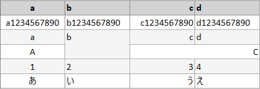
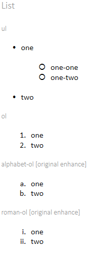
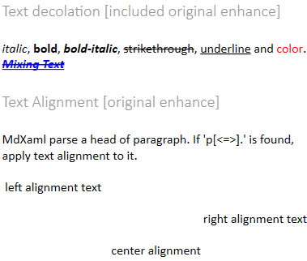

# MdXaml

MdXaml is a modify version of Markdown.Xaml.
It can convert Markdown to FlowDocument of WPF.
[(for japanese|日本語)](index_jp.md)

## What are Markdown.Xaml and MdXaml ?

About Markdown.Xaml, [see the origin project page](https://github.com/theunrepentantgeek/Markdown.XAML).

Markdown.Xaml( and MdXaml ) is a port of the popular 
[MarkdownSharp](http://code.google.com/p/markdownsharp/) Markdown processor, but with one very 
significant difference: Instead of rendering to a string containing HTML, it renders to a 
[FlowDocument](http://msdn.microsoft.com/en-us/library/system.windows.documents.flowdocument.aspx) 
suitable for embedding into a WPF window or usercontrol.

Additionary, MdXaml add the bellow.

* Put some styles that are scattered in Markdown.Xaml together.
* Embedded Image resource.
* Custom extension of Markdown
    * table-colspan/rowspan
    * other list mark(alphabet, italic)
    * text-decoration(strikethrough, underline, color)
    * text-align

## Example

If you want to try yourself, please download [Demo-application](MdXaml_Demo.zip) and execute it.

### table


### list


### text-decoration and text-align


## Nuget

1. [https://www.nuget.org/packages/MdXaml/](https://www.nuget.org/packages/MdXaml/)
2. [https://www.nuget.org/packages/MdXaml_migfree/](https://www.nuget.org/packages/MdXaml_migfree/)

If you want to change dependency library from Markdown.Xaml to MdXaml quickly. use the second link. It keeps the namespace to "Markdown.Xaml".

## Quick start 

### Transform markdown to flowdocument

```cs
// using MdXaml;
// using System.Windows.Documents;

Markdown engine = new Markdown();

string markdownTxt = System.IO.File.ReadAllText("example.md");

FlowDocument document = engine.Transform(markdownTxt);
```

### Render markdown in Control

**SampleControl.xaml**
```xml
<UserControl x:Class="MdXamlSample.SampleControl"
        xmlns="http://schemas.microsoft.com/winfx/2006/xaml/presentation"
        xmlns:x="http://schemas.microsoft.com/winfx/2006/xaml"
        xmlns:mdxam="clr-namespace:MdXaml;assembly=MdXaml"
        xmlns:local="clr-namespace:MdXamlSample">

    <UserControl.DataContext>
        <local:SampleControlViewModel/>
    </UserControl.DataContext>

    <!--
    <mdxam:MarkdownScrollViewer
            MarkdownStyle="{Binding DocStyle}"
            Markdown="{Binding MarkdownDoc}"
            />
    -->

    <mdxam:MarkdownScrollViewer
            Markdown="{Binding MarkdownDoc}"
            />
</UserControl>
```

**SampleControlViewModel.cs**
```cs
namespace MdXamlSample {
    class SampleControlViewModel{
        // public Style DocStyle {get; set;}
        public string MarkdownDoc {get; set;}
    }
}
```

### More document
* [Image reading priority order](image_load_priority.md)
* [enhance(list, table, text-decoration)](original_enhance.md)

## License

MdXaml is licensed under the MIT license.