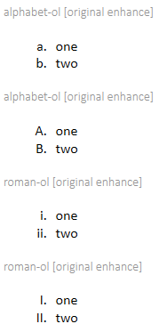
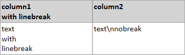
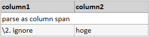

# Markdown original enhance

## Text decolation

MdXaml support italic, bold, strikethrough, underline, and color text.

Below table shows each idioms.

### Example

```txt
|name          |format                      |
|--------------|----------------------------|
|italic        | *italic*                   |
|bold          | **bold**                   |
|bold-italic   | ***bold-italic***          |
|strikethrough | ~~strikethrough~~          |
|underline     | __underline__              |
|color-text(1) | %{color:red}colortext%     |
|color-text(2) | %{color:#00FF00}colortext% |

```


## Text alignment

MdXaml support text-alignment. It is base on textile.

* If put 'p<.' to paragraph-start, MdXaml arrange paragraph left-side.
* If put 'p>.' to paragraph-start, MdXaml arrange paragraph right-side.
* If put 'p=.' to paragraph-start, MdXaml arrange paragraph center.

### Example
```txt
p<. arrange paragraph left-side.

p>. arrange paragraph right-side.

p=. arrange paragraph center.  
p=>. inner paragraph is ignored.
```


## list
```txt
#### alphabet-ol [original enhance]
a. one
b. two

#### alphabet-ol [original enhance]
A. one
B. two

#### roman-ol [original enhance]
i, one
ii, two

#### roman-ol [original enhance]
I, one
II, two
```


## Table 

### linebreak

MdXaml treats '\n' which is contained in the cell of tables as linebreak.
If you don't want it, use escape sequence.

#### Example

```txt
| column1\nwith linebreak     | column2       |
|-----------------------------|---------------|
| text\nwith\nlinebreak       | text\\nnobreak|
```


### colspan or rowspan

MdXaml extends table format to explain colspan and rowspan. Its format is Influenced by textile.

#### Example

```txt
| column1     | column2       | column4       | column5  |
|-------------|---------------|---------------|----------|
|\2. colspan2                 |/3\2. row3&col2           |
|/2. rowspan2 |<. left-algn   |
              |=. center-algn |
| hoge        |>. right-align | hoge          | hoge     |

```


#### Format

Type any character between pipe(|) and period(.), and MdXaml parse it.

| char | details                                                      |
|------|--------------------------------------------------------------|
| \\   | column span: after character parse as the number as columns. |
| /    | row span: after character parse as the number as rows.       |
| <    | left alignment  |
| >    | right alignment |
| =    | center          |

If you don't want to parse, type space after pipe(|).

```txt
| column1     | column2       |
|-------------|---------------|
|\2. parse as column span     |
| \2. ignore  | hoge          |
```




### [MarkdownTableBuilder.ods](MarkdownTableBuilder.ods)

To make table easily, We provide 'MarkdownTableBuilder.ods'.
With LibreOffice It can open it and execute macros.


